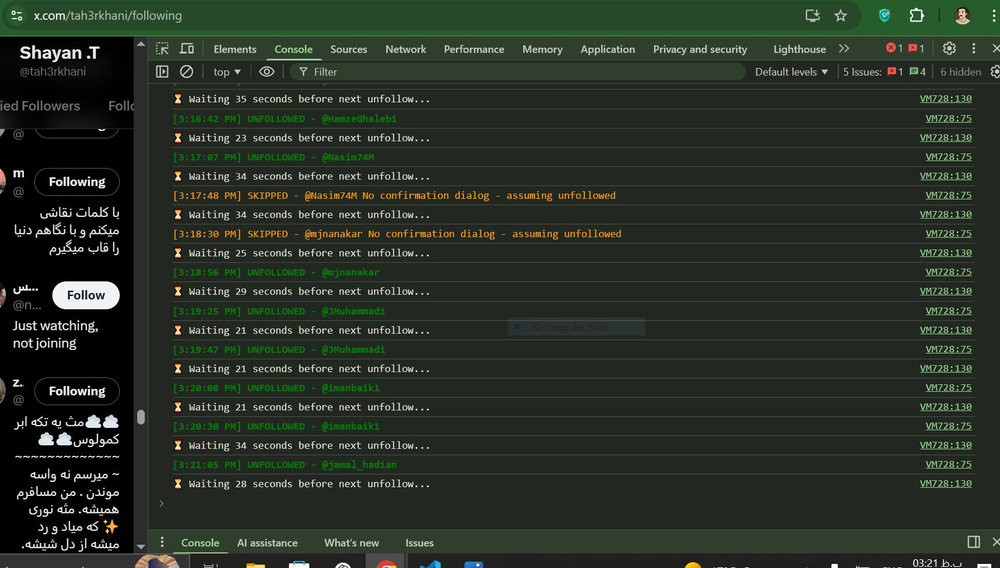

# X/Twitter Mass Unfollow Non-Followers 2025 – Ultra Safe Script 🚀

**دقیق‌ترین و امن‌ترین اسکریپت کنسول برای آنفالو کردن کسایی که بک ندادن (نسخه ۲۰۲۵)** بدون نیاز به اکستنشن · بدون API · ضد بن (Zero Ban) · تست شده و ۱۰۰٪ فعال (نوامبر ۲۰۲۵)

## چرا این اسکریپت خفن‌ترین گزینه سال ۲۰۲۵ هست؟ 😎

اگه خسته شدی از اینکه الکی فالووینگ‌هات بالا باشه و کسی بک نده، این اسکریپت کارتو راه میندازه. چرا بهترینی؟

- **تشخیص هوشمند دکمه‌ها:** ۱۰۰٪ دقیق دکمه "Following" رو پیدا می‌کنه (حتی اگه ایلان ماسک UI رو عوض کنه).
- **لاگ کردن واقعی:** دقیقاً می‌نویسه چه یوزرنیمی (`@username`) رو آنفالو کرده.
- **رفتار انسانی (ضد ربات):** بین هر کلیک ۲۵ تا ۴۰ ثانیه دیلی (Delay) رندوم میندازه که توییتر شک نکنه رباتی.
- **لیمیت ایمنی:** خودش بعد از ۱۹۰ تا آنفالو استپ می‌کنه که یه وقت لیمیت یا شدوبن نشی.
- **هندل کردن ارورها:** دیالوگ‌های تأیید یا ارورها رو خودش تشخیص میده و رد می‌کنه.
- **جلوگیری از دوباره‌کاری:** امکان نداره یه دستور رو دوبار اجرا کنه.
- **خروجی خوشگل:** توی کنسول با رنگ‌بندی مرتب و یه جدول گزارش نهایی بهت آمار میده.
- **سازگار با همه:** روی کروم، فایرفاکس و اج (دسکتاپ) مثل بنز کار می‌کنه.

## چطوری استفاده کنیم؟ (کلا ۳۰ ثانیه وقتت رو می‌گیره) ⏱️

1. برو تو صفحه فالووینگ‌های خودت: https://x.com/yourusername/following
2. **اسکرول کن پایین!** انقدر اسکرول کن که حداقل ۳۰۰ تا ۵۰۰ تا پروفایل لود بشه (چون اسکریپت فقط چیزایی که لود شده رو میبینه).
3. اینسپکت بگیر (`F12` یا `Ctrl+Shift+J`) و برو تب **Console**.
4. کل کدهای فایل [`unfollow.js`](unfollow.js) رو کپی کن و اونجا پیست کن.
5. اینتر رو بزن و ریلکس کن ☕.

> **نکته مهم:** اسکریپت بعد از ۱۹۰ تا آنفالو خودش متوقف میشه (برای امنیت پیجت). اگه خواستی بیشتر آنفالو کنی، دوباره اسکرول کن و دوباره کد رو ران کن.

## اسکرین‌شات محیط کار

## سازنده 👨‍💻

**شایان طاهرخانی** Website: https://shayantaherkhani.ir  
X/Twitter: [@tah3rkhani](https://twitter.com/tah3rkhani)

## نکته حقوقی (Legal Note) ⚖️

این اسکریپت صرفاً رابط کاربری وب عمومی رو اتومیت می‌کنه. استفاده ازش با مسئولیت خودتونه.  
توییتر (X) ممکنه هر لحظه UI رو عوض کنه، ولی من سعی می‌کنم این رپو رو همیشه آپدیت نگه دارم.

## تاریخچه ستاره‌ها (Star History)

---
⭐ **اگه این اسکریپت ساعت‌ها وقتت رو سیو کرد و حال کردی، دمت گرم یه استار (Star) به رپو بده!** ⭐
